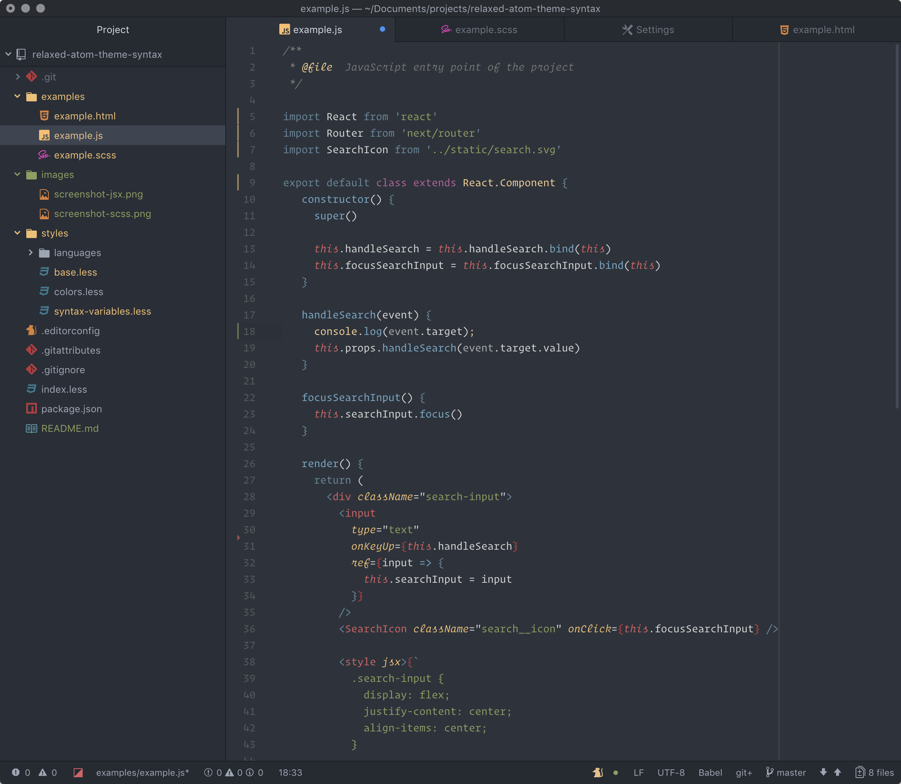
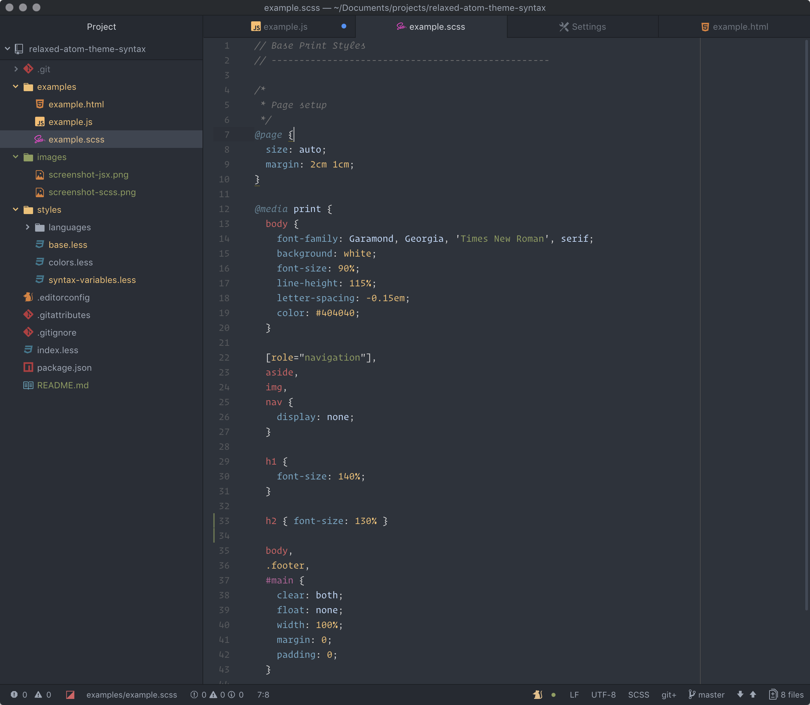
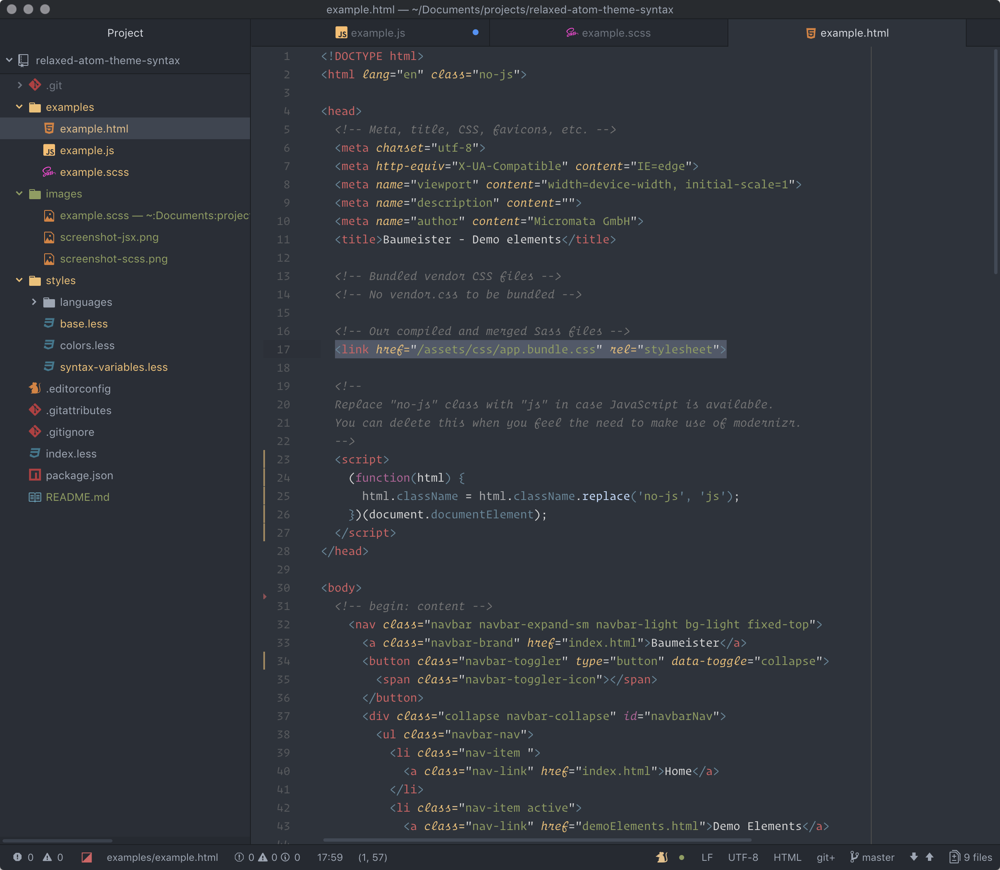

[](https://github.com/Relaxed-Theme/atom-relaxed-syntax/releases)

# Relaxed syntax theme for Atom

> A relaxed Atom syntax theme to take a more relaxed view of things.

*Recommended UI theme to use with this syntax theme: [One Dark UI theme](https://atom.io/themes/one-dark-ui)*



<details>
  <summary>Screenshot: Sass</summary>
  <p>&nbsp;</p>
  
</details>

<details>
  <summary>Screenshot: HTML</summary>
  <p>&nbsp;</p>
  
</details>

## Installation

Install the City Lights Syntax Theme via Atom by going to:
**Preferences/Settings > Install** and search for Relaxed Syntax Theme (make sure you're searching under 'Themes').

Or install through CLI via:

```
apm install atom-relaxed-syntax
```

## I don't like something

This theme is new so if something is funky, please open an issue.

## Related

* [Relaxed theme for Terminal](https://github.com/Relaxed-Theme/Relaxed-Terminal) - For iTerm, Hyper, the macOS Terminal and a bunch of others.
* [Relaxed theme for Visual Studio Code](https://github.com/Relaxed-Theme/vscode-theme-relaxed) - The VS Code adaption.

## License

Please be aware of the licenses of the components we use in this project.
Everything else that has been developed by the contributions to this project is under [MIT License](LICENSE).
